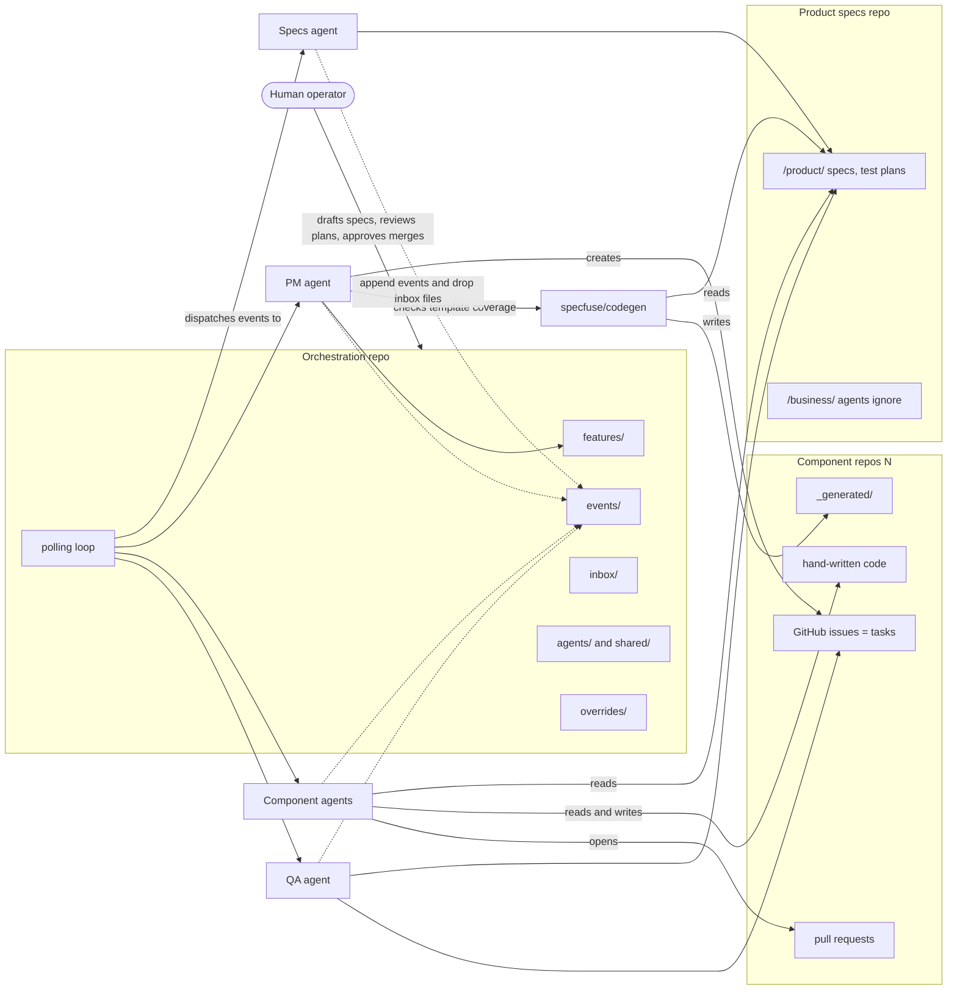
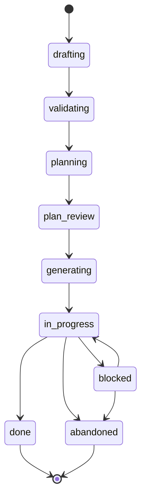
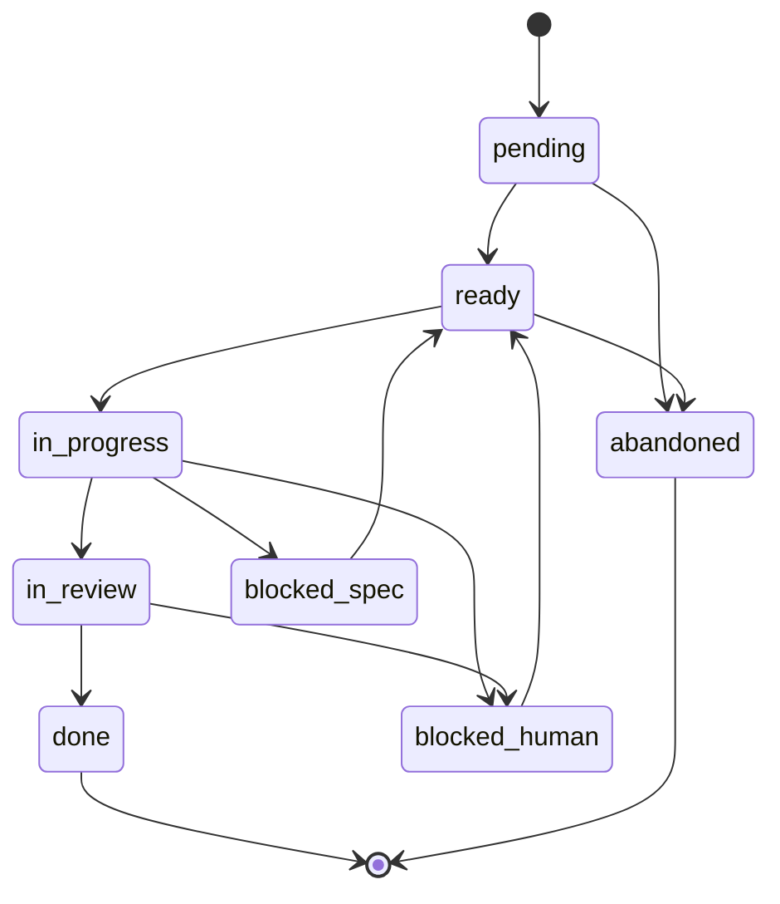

# Specfuse Orchestrator — Architecture

## 1. Introduction

This document describes the architecture of the Specfuse Orchestrator: the components that make it up, how they are arranged, how work flows between them, and who owns each responsibility. It is a technical reference, not an introduction to the project; readers unfamiliar with the orchestrator's goals should read the vision document first.

Two audiences consume this document. **Humans** read it to understand how the system fits together and to debug when something goes wrong. **AI agents operating inside the system** read it to understand their own role and the contracts they must respect when coordinating with other agents. The prose is written to serve both, which sometimes means stating things more explicitly than a human reader alone would require. Where a statement says "the PM agent owns X," the reader can assume the PM agent's configuration will cite this document as the normative reference.

When this document and an individual agent's `CLAUDE.md` disagree, this document wins and the agent configuration is wrong.

## 2. System overview

The orchestrator coordinates four specialized agent roles across three categories of repository. One repository — the orchestration repo — holds the process state that binds everything together. Other repositories hold product specifications and the code that implements the product. Humans drive the system at well-defined gates; agents handle the work between those gates.



The diagram shows three structural facts worth stating explicitly. First, the orchestration repo is passive storage plus a polling loop; it holds no business logic beyond dispatch. Second, every agent reads from the product specs repo but only writes to designated surfaces — issues, PRs, the event log, and the inbox. Third, the Specfuse code generator is a non-agent system participant: it reads specs and writes generated code deterministically, and is consulted by the PM agent during planning to confirm that the templates needed for the feature exist. It does not read the override registry in the initial model (see §9.3).

## 3. Vocabulary

Precise vocabulary is load-bearing here. Agents pattern-match on these terms.

**Feature.** A spec-driven unit of product value. Features span repositories. Their canonical state lives as a markdown file in the orchestration repo's `/features/` directory, with YAML frontmatter carrying the machine-readable fields: current state, correlation ID, involved repos, autonomy default, and the approved task graph.

**Task.** An implementation work unit inside a single component repository. A task is represented as a GitHub issue in that component's repo. The GitHub issue's open/closed state plus its labels constitute the canonical task state; the orchestration repo mirrors this via events but does not own it. This split — features above the repo layer, tasks inside it — keeps each piece of state in exactly one place.

**Task types.** Every task has one of four types: `implementation` (code written by a component agent), `qa_authoring` (test plan authored by the QA agent), `qa_execution` (test plan executed by the QA agent), and `qa_curation` (regression suite curated by the QA agent). All four share the same state machine; type only affects which agent picks up the work and what the work unit prompt contains.

**Correlation ID.** Every feature receives an ID of the form `FEAT-YYYY-NNNN` (e.g. `FEAT-2026-0042`). Every task receives a sub-ID of the form `FEAT-YYYY-NNNN/TNN` (e.g. `FEAT-2026-0042/T07`). These IDs appear in: feature registry filenames, every event log entry, GitHub issue titles, branch names, commit message trailers (`Feature: FEAT-YYYY-NNNN/TNN`), and PR descriptions. A single correlation ID threads a unit of work across every repository and every agent. Reasoning: a cross-repo, multi-agent system without a single correlation scheme becomes impossible to audit after the fact.

**Autonomy levels.** Three values, set as a feature-level default during specs and overridable per-task during plan review:

- `auto` — agent executes end to end, opens PR, merges on green CI once auto-merge is enabled (currently disabled; see §10).
- `review` — agent executes, opens PR, human approves merge.
- `supervised` — agent proposes a plan as an issue comment before writing any code; human says "go" first.

Autonomy is a per-task property. A single feature's task graph may mix all three levels.

## 4. Repository topology

### 4.1 Three repo categories

**The orchestration repo.** Owned by the orchestrator itself. Contains process state, agent configuration, and the polling loop. No product code lives here.

**The product specs repo.** Owned by the product team. Contains specifications (OpenAPI, AsyncAPI, Arazzo), the Specfuse project file, test plans, product documentation, brand assets, and business collateral. Its top level is split:

- `/product/` — specs, test plans, feature descriptions. Agent-readable.
- `/business/` — brand guidelines, marketing collateral, sales assets, support documentation. Agents are configured to ignore this entire subtree.

Reasoning: non-technical teams commit frequently to `/business/`. If agents saw those changes, irrelevant churn would confuse planning and waste context.

**Component repositories.** One per component of the product being built (for example: API, persistence, workers, frontend, mobile). Each contains both generated code (in a clearly marked `_generated` or `gen-src` directory) and hand-written business logic. GitHub issues in these repos represent tasks.

### 4.2 Orchestration repo layout

- `/features/` — one markdown file per feature, frontmatter-fronted. Source of truth for feature state.
- `/events/` — append-only JSONL event log, one file per feature keyed by correlation ID.
- `/inbox/` — structured event files dropped by agents; consumed by the polling loop and archived after dispatch.
- `/agents/<role>/` — per-agent configuration (see §5).
- `/shared/` — cross-agent rules, schemas, protocols, templates.
- `/overrides/` — active override records against generated code (see §9).
- `/scripts/` — polling loop and orchestration tooling.

Reasoning for plain files over a database: at the initial target scale (2–3 features per week, a handful of repos), git gives diff tooling, multi-writer safety, audit trail, and history for free. A database would pay none of these back. The design can accommodate a database later if scale demands it, and doing so would not be a rewrite.

### 4.3 Test plan location

Test plans live in the product specs repo under `/product/test-plans/`. The QA agent writes them during `qa_authoring`. Execution results do **not** live there — they are written to the orchestration event log. **Plan is product; execution history is process.** Keeping them in the right repos keeps each repo's purpose clean.

## 5. Agents

### 5.1 Roles

Four operational agent roles perform the work; a fifth meta-role handles configuration hygiene.

- **Specs agent** — helps the human draft specifications and runs Specfuse validation. Reads and writes `/product/`.
- **PM agent** — converts validated specs into a task graph, collaborates with the human on work unit prompts, creates GitHub issues, and recomputes task dependencies on every completion.
- **Component agent** — one instance per component repository; picks up ready issues, writes code, opens PRs. Reads `/product/`; writes to hand-written code paths in its component repo.
- **QA agent** — authors test plans, executes them, curates regression suites. Writes `/product/test-plans/`, logs execution results to the event log, and opens regression issues in component repos.
- **Config-steward agent** — a meta-agent that watches commits to `/agents/` and `/shared/`, proposes version bumps and changelog lines, and commits them alongside the original change. See §5.4.

### 5.2 Configuration layout

Each operational role has a directory under `/agents/`:

```
/agents/<role>/
    CLAUDE.md
    skills/
    rules/
    version.md
```

The role's `CLAUDE.md` pulls in shared definitions first, then layers role-specific behavior on top. Skills and rules follow the same precedence: shared first, role-specific on top.

### 5.3 Shared vs role-specific

The split is governed by a single test: **if two agents would behave differently on the same rule, it's role-specific; if they must behave identically, it's shared.**

In `/shared/`: the correlation ID scheme, event log format and schema, feature and task state vocabulary and transitions, issue body templates (work unit, spec issue, QA regression, human escalation), the "never touch" list (generated directories, branch protection, secrets, `/business/`), the override registry protocol, the escalation-to-human protocol, the verify-before-report discipline (state intent, act, verify, report structured output), and security boundaries.

In `/agents/<role>/`: core reasoning prompts for the role, tools and MCP servers available to the role, role-specific verification steps, and role-specific output formats.

Reasoning: shared content drifts if each agent owns its own copy. Centralizing it means a single edit updates every agent at once, and the test above makes the partitioning decision mechanical rather than a judgment call.

### 5.4 Versioning

Every agent configuration carries a version. Every change to a `CLAUDE.md`, skill, or rule file requires a version bump and a changelog line. The event log records which agent version handled each event, so behavior changes can be reconstructed after the fact.

Because manual version-bump discipline is unreliable, the config-steward agent automates it: on every commit to `/agents/` or `/shared/`, it reads the diff, proposes a version bump and changelog entry, and commits that alongside the original change. The human reviews the stewarded commit the same way as any other PR.

### 5.5 Non-agent participants: the Specfuse generator

The Specfuse generator (`specfuse/codegen`) is an actor in the system but not an agent. It is deterministic tooling — given the same specs and templates, it produces the same output — so it is not versioned or prompted the way agents are. It is listed here because readers of §5 are asking "who does work in this system?" and the generator is one of the answers.

The generator interacts with the orchestrator at three points: the PM agent queries it during planning to confirm template coverage (§9.2); component and QA agents raise structured spec issues when they find problems in its output (§9.1); and, eventually, a feedback loop will propagate those issues back into template changes (see the implementation plan's Phase 5). Detailed interaction semantics live in §9.

## 6. State machines

### 6.1 Feature state machine



| State | Meaning | Owner of entry transition |
|---|---|---|
| `drafting` | Human writing specs with the specs agent | Human (creates feature) |
| `validating` | Specfuse validation running | Specs agent |
| `planning` | PM agent building the task graph | Specs agent |
| `plan_review` | Human reviewing/editing the plan | PM agent |
| `generating` | Specfuse producing boilerplate across component repos | Human (approval gate) |
| `in_progress` | At least one task active | PM agent (after generation) |
| `blocked` | Feature-level issue requires human attention | Any agent (on feature-level escalation) |
| `done` | All tasks complete | PM agent (on last task `done`) |
| `abandoned` | Explicitly killed | Human |

### 6.2 Task state machine



| State | Meaning | Owner of entry transition |
|---|---|---|
| `pending` | Exists, dependencies unmet | PM agent (creates issue) |
| `ready` | Dependencies met, boilerplate confirmed, prompt attached | PM agent (dependency recomputation) |
| `in_progress` | Component agent actively working | Component agent |
| `in_review` | PR open, awaiting review | Component agent |
| `blocked_spec` | Spec-level issue raised; escalated to specs/generator | Component agent (or QA) |
| `blocked_human` | Spinning detected or autonomy requires intervention | Component agent, QA agent, or polling loop |
| `done` | PR merged | Merge watcher (GitHub Action) |
| `abandoned` | Task killed | Human or PM agent |

### 6.3 Transition ownership, explicitly

- **Specs agent**: `drafting → validating → planning`.
- **PM agent**: `planning → plan_review`, `generating → in_progress`, and all `pending → ready` transitions. Also owns dependency recomputation: when any task enters `done`, the PM agent re-evaluates every `pending` task and flips the newly-unblocked ones to `ready`.
- **Human**: `plan_review → generating` (approval gate), every `blocked_* → ready` unblock transition, every `* → abandoned` transition on a live task.
- **Component agent**: `ready → in_progress → in_review`, plus `in_progress → blocked_spec` and `in_progress → blocked_human`.
- **QA agent**: same transitions as component agent for its own task types.
- **Merge watcher** (GitHub Action, not an agent): `in_review → done`, gated on branch protection checks passing.

Dependency recomputation **must** be centralized in the PM agent. Component agents emit a structured `task_completed` event; they do not decide what to unblock. Reasoning: distributed unblock logic would race, produce duplicate issue creation, and make the dependency graph unauditable. One writer, one source of truth.

### 6.4 Spinning detection

A task transitions to `blocked_human` automatically on any of:

- Three consecutive failed verification cycles.
- Wall-clock time exceeded (threshold TBD; start conservative).
- Token budget exceeded (threshold TBD; tied to rate-limit protection on the active subscription plan).

QA-execution failures follow the same rule, scoped per implementation task they exercise. A first failure opens a structured regression issue against the implementation task and flips it back to a regression state. A repeated failure after an attempted fix escalates to human.

Reasoning: agents that spin silently burn tokens and time without producing value. Detecting the pattern and handing off beats letting them grind indefinitely.

## 7. Coordination substrate

### 7.1 Git as substrate

Git provides the audit log, diff tooling, and multi-writer-safe semantics the orchestrator needs. The orchestration repo uses plain markdown files and JSONL event logs, versioned in git, as the primary coordination medium. No database is required at the initial target scale, and adding one later is a migration, not a rewrite.

### 7.2 Event-driven interface, polling-based execution

All agent invocations flow through a single stateless interface, conceptually shaped as `handle_event(event_type, correlation_id, payload)`. The initial implementation is a polling loop the human operator starts and stops manually on their local machine; the loop reads `/inbox/`, dispatches each event to the appropriate handler, and archives the processed file.

No business logic lives in the poller. It is a dispatcher. Swapping it for webhooks or GitHub Actions later is a configuration change, not an architectural one. Reasoning: local-first operation is what the initial target scale justifies, and keeping the business logic out of the transport layer means the transport can be replaced without touching the agents.

### 7.3 Event log schema

Every significant action appends a JSONL entry to the feature's event log file. Required fields:

- `timestamp` — ISO 8601.
- `correlation_id` — feature or task ID.
- `event_type` — from the enumerated set below.
- `source` — agent role (for example `pm`, `component:api`) or `human`.
- `source_version` — agent configuration version at the time of the event.
- `payload` — event-specific structured content.

Minimum event type set: `feature_created`, `spec_validated`, `plan_generated`, `plan_approved`, `task_created`, `task_ready`, `task_started`, `task_completed`, `task_blocked`, `spec_issue_raised`, `override_applied`, `override_expired`, `human_escalation`. The full set is expected to grow during Phase 0; new types must be registered in `/shared/schemas/` before use.

### 7.4 Inbox flow

When an agent needs to trigger action in a part of the system it cannot directly modify — for example, a component agent raising a spec issue that belongs to the specs agent — it writes a structured file to the appropriate `/inbox/<type>/` subdirectory. The polling loop reads the inbox, dispatches to the handler, and archives the file.

This layer is intentionally underspecified at this stage. Concurrency semantics, idempotency guarantees, and failure handling will be refined as real issues surface. **The inbox is the most likely source of early debugging time and is treated with appropriate humility.** Every change here must be justified by an observed problem, not a theoretical one.

## 8. Work unit contract

A work unit prompt is the content placed inside a GitHub issue's body that a component agent consumes to execute a task. It is the PM-agent-to-component-agent interface, and therefore architectural.

Prompts are drafted by the PM agent collaboratively with the human during the planning phase. The interaction pattern mirrors a human working with Claude in a planning session: the PM agent proposes, the human refines, the final prompt is one the human endorses.

Every work unit prompt, regardless of how it was generated, **must** include:

- **Context preamble** — what this task is part of, correlation ID, related specs.
- **Acceptance criteria** — explicit, testable statements of done.
- **"Do not touch" boundaries** — generated code paths, files owned by other tasks, files under `/business/`, branch protection configuration, secrets.
- **Verification commands** — exact commands the agent must run before declaring the task done.
- **Escalation triggers** — conditions under which the agent must stop and raise a structured issue rather than push through.

The issue body template lives in `/shared/templates/` and is enforced at issue creation time. An issue created without all five sections is malformed and rejected by the PM agent's self-check. Reasoning: these five sections are the minimum a component agent needs to do its job without hallucinating scope or boundaries. Making them mandatory eliminates a class of failure mode.

## 9. Generated code, templates, and overrides

### 9.1 Generated code rules

Generated code lives in dedicated directories (`_generated`, `gen-src`, or equivalent) inside each component repo. Three rules apply:

1. Under normal flow, only the Specfuse generator writes to these directories. Authorized overrides are the exception and are covered in §9.3.
2. Generated directories are clearly separated from hand-written business logic.
3. They are safe to regenerate; component agents must assume that any file under a generated directory can be overwritten at any time by a generator run.

When a component or QA agent encounters a problem in generated code, it **raises a structured spec issue** rather than modifying the file. The issue flows through the inbox to the specs agent or the generator maintainer. Modification happens only under an authorized override.

### 9.2 Template coverage at plan time

The PM agent does not assume the generator can produce every artifact a feature needs. During planning, it checks template coverage against the generator: are there templates for every generated surface this feature requires?

If there are template gaps, the PM agent includes work in the task graph to close them — typically as tasks against the generator project rather than against a component repo. Who executes those tasks (human, a future generator-maintainer agent role, or a component agent with appropriate authorization) is deliberately left open at this layer; the architectural commitment is that template gaps are **identified and planned for at plan time**, not discovered when a component agent goes to write code against boilerplate that does not exist.

Reasoning: discovering missing templates mid-implementation forces mid-flight replanning, which is exactly the kind of coordination failure the orchestrator exists to prevent. Checking at plan time moves the problem to where the human is already engaged.

### 9.3 Override registry and reconciliation

An override is an authorized manual change to a file inside a generated directory. Every override is a structured record in `/overrides/`:

- **File(s) overridden** — paths, relative to the component repo.
- **Task that required the override** — correlation ID.
- **Tracking issue** — the issue whose closure retires the override (typically a spec or generator issue).
- **Expiry condition** — typically "on closure of issue #N".
- **Timestamp** — when the override was authorized.

**Initial model: the generator does not read the override registry.** On every run it regenerates deterministically and blindly overwrites whatever lives in the generated directories, including manual overrides applied since the last run. The registry exists for the agents, not the generator.

After any regeneration, the component agent owning the affected repo walks the set of active overrides against that repo and, for each one, performs a reconciliation:

- If the tracking issue still reflects reality — the underlying generator problem has not been fixed, and the manual change is still needed — the component agent reapplies the override and records the reconciliation in the event log.
- If the tracking issue has been resolved upstream — the regenerated output already behaves correctly — the component agent closes the tracking issue, marks the override expired in `/overrides/`, and logs the retirement.

This reconciliation is the component agent's responsibility, not the generator's, and not the human's. It is triggered by the regeneration event and is itself subject to spinning detection: an override that fails reapplication cleanly is a `blocked_spec` condition.

**Future model (deferred):** once the generator feedback loop is in place (implementation plan's Phase 5), the generator will read the override registry and respect it during generation. That change inverts the direction of control — registry becomes authoritative — and is deferred because it raises the blast radius of a generator bug substantially. Until then, the initial model accepts that overrides can be clobbered between regen and reconciliation as a known, bounded risk.

Reasoning: overrides are a safety valve, not a permanent escape hatch. Tying every override to an expiring condition keeps the generator the long-term source of truth and prevents `_generated/` from slowly becoming a hand-maintained codebase in disguise. Putting reconciliation on the component agent — rather than on the generator — keeps the generator simple in the initial model and pushes the judgment call ("is this override still needed?") to the actor that has the most context to answer it.

## 10. Merge gating

Merge gates are enforced via **GitHub branch protection**, not agent discipline. Required checks:

- All tests passing.
- Code coverage ≥ 90%.
- Zero compiler warnings.
- OWASP security scan clean.
- Linting clean.
- Required reviewers satisfied.

**Current operating state:** all merges are human-performed regardless of a task's autonomy level. The `auto` autonomy level does not currently trigger auto-merge.

**Future state (deferred):** the PM agent applies an `auto-merge-enabled` label based on task autonomy, and a GitHub Action performs the merge once all required checks pass. This is gated on the QA loop being trusted. Until then, human judgment sits on the merge button.

Reasoning: placing the gates in branch protection means an agent cannot accidentally or adversarially bypass them, and a human on the merge button cannot either. The rule is enforced by infrastructure, not discipline.

## 11. Deferred decisions

The following architectural choices are acknowledged but not yet settled. They are documented here so readers do not assume an answer exists elsewhere:

- Exact thresholds for spinning detection — iterations, wall-clock, token budget.
- Specific implementation technology for the polling loop — shell script, Python, other.
- The full set of event types beyond the minimum listed in §7.3.
- Naming conventions for feature registry markdown files.
- The specific GitHub issue label taxonomy that encodes task state and task type.

Each will be resolved during the phase that first needs it, and this document updated accordingly.
