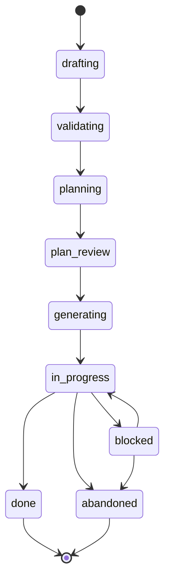
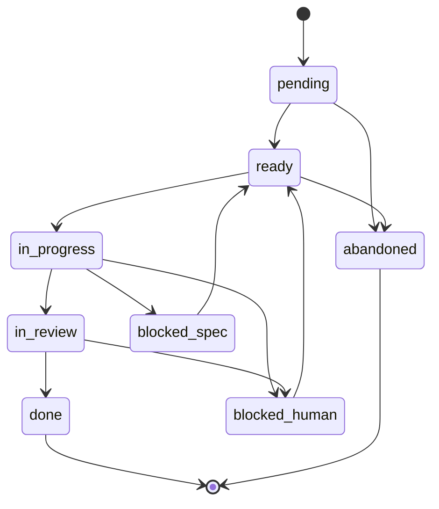

# State vocabulary

Two state machines govern work in the orchestrator: one for features, one for tasks. Every agent pattern-matches on the state names and transition owners listed here, so exact wording is load-bearing.

**Architecture §6 is normative.** This file mirrors the state machines and transition ownership in architecture §6.1–§6.3 for agents that pull `/shared/rules/` into context. If this file and the architecture document disagree, the architecture wins and this file is wrong.

## Feature states

| State | Meaning | Owner of entry transition |
|---|---|---|
| `drafting` | Human writing specs with the specs agent | Human (creates feature) |
| `validating` | Specfuse validation running | Specs agent |
| `planning` | PM agent building the task graph | Specs agent |
| `plan_review` | Human reviewing/editing the plan | PM agent |
| `generating` | Specfuse producing boilerplate across component repos | Human (approval gate) |
| `in_progress` | At least one task is active | PM agent (after generation) |
| `blocked` | Feature-level issue requires human attention | Any agent (on feature-level escalation) |
| `done` | All tasks complete | PM agent (on last task `done`) |
| `abandoned` | Explicitly killed | Human |

The enum in `shared/schemas/feature-frontmatter.schema.json` is the machine-readable source for these names. A feature whose frontmatter `state` falls outside this enum is invalid.

## Task states

| State | Meaning | Owner of entry transition |
|---|---|---|
| `pending` | Exists, dependencies unmet | PM agent (creates issue) |
| `ready` | Dependencies met, boilerplate confirmed, prompt attached | PM agent (dependency recomputation) |
| `in_progress` | Component/QA agent actively working | Component agent or QA agent |
| `in_review` | PR open, awaiting review | Component agent or QA agent |
| `blocked_spec` | Spec-level issue raised; escalated to specs/generator | Component agent or QA agent |
| `blocked_human` | Spinning detected or autonomy requires intervention | Component agent, QA agent, or polling loop |
| `done` | PR merged | Merge watcher (GitHub Action) |
| `abandoned` | Task killed | Human or PM agent |

Task state is encoded as the GitHub issue's open/closed flag plus one `state:*` label from `shared/schemas/labels.md`. Slug mapping: `blocked_spec` → `state:blocked-spec`, `blocked_human` → `state:blocked-human` (GitHub labels do not allow underscores).

## Transition ownership, explicitly

Per architecture §6.3, the following are the only agents authorized to move a feature or task into the listed state. "Owner of entry transition" means the role that writes the new state; no other role may do so.

- **Specs agent:** `drafting → validating`, `validating → planning`.
- **PM agent:** `planning → plan_review`, `generating → in_progress`, every `pending → ready` (via dependency recomputation), and `in_progress → done` on the feature when the last task reaches `done`.
- **Component agent:** `ready → in_progress`, `in_progress → in_review`, `in_progress → blocked_spec`, `in_progress → blocked_human`, `in_review → blocked_human`.
- **QA agent:** same transitions as the component agent, scoped to its own task types (`qa_authoring`, `qa_execution`, `qa_curation`).
- **Merge watcher** (GitHub Action, not an agent): `in_review → done`, gated on all branch-protection checks passing.
- **Polling loop** (also not an agent): may transition a task to `blocked_human` when spinning-detection thresholds trip (see architecture §6.4).
- **Human:** `plan_review → generating` (approval gate), every task-level `blocked_* → ready` unblock, every feature-level `blocked → in_progress` unblock, every `* → abandoned` on a live feature or task.
- **Any agent:** may transition a feature from `in_progress → blocked` on a feature-level escalation (architecture §6.1 table). Task-level `blocked_*` transitions are scoped to the role table above.

### Centralized dependency recomputation

Dependency recomputation is centralized in the PM agent. When any task enters `done`, the PM agent re-evaluates every `pending` task in that feature and flips the newly-unblocked ones to `ready`. Component and QA agents emit a structured `task_completed` event; they do not decide what to unblock. Distributed unblock logic would race, produce duplicate issue creation, and make the dependency graph unauditable (architecture §6.3).

### Spinning detection

The polling loop may auto-transition a task to `blocked_human` on any of:

- Three consecutive failed verification cycles.
- Wall-clock time exceeded (threshold TBD; start conservative).
- Token budget exceeded (threshold TBD; tied to rate-limit protection).

QA-execution failures follow the same rule scoped per implementation task: a first failure opens a structured regression issue and flips the implementation task back to a regression state; a repeat failure after an attempted fix escalates to human. See architecture §6.4.

## Using this vocabulary

Emit state names exactly as spelled above. `in_progress` has an underscore; the GitHub label slug `state:in-progress` uses a hyphen because GitHub labels require it — the mapping is mechanical and one-to-one, and agents should not invent alternate spellings.

Before writing a state transition, check that your role owns the entry transition for the target state. If it does not, you are about to violate the ownership rule; stop and raise an escalation rather than transitioning anyway.
